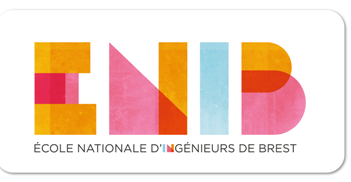

<div align="center">
<h1 align="center">

<br>Musée</h1>

<h3>◦ Developpé par:</h3>
<div style="display:flex; flex-direction:column; text-align:center">
<a href="https://github.com/BAGUIAN01" style="color: black;text-align:center">Harouna BAGUIAN</a>
<a href="#" style="color: black;">JEGOUZO Ewen</a>


</div>


<p align="center">


</p>
</div>

_ _ _

## 📖 Table de matières
- [📖 Table de matières](#-Table de matières)
- [📍 Resumé](#-Resumé)
- [📂 Structure du projet](#-repository-structure)
- [⚙️ Modules](#modules)
- [🚀 Prise en main](#-getting-started)
- [🛣 Bibliographie](#-bibliographie)


---


## 📍 Resumé

Pour notre projet de 5e année en réalité virtuelle, nous avons conçu un musée thématique alliant la Renaissance et l'univers de Star Wars. Le musée est structuré en un hall d'entrée et trois salles principales au rez-de-chaussée. La salle à droite est dédiée à Tatooine, mettant en avant la renaissance de la Force avec le retour d'Obi-Wan Kenobi, qui veille sur le jeune Luke Skywalker. La salle centrale présente Naboo et le mariage de Padmé Amidala, illustrant des influences de la Renaissance à travers sa robe longue. La salle à gauche est consacrée à l'Étoile Noire, la base de Dark Vador, symbolisant la genèse de l'ennemi dans la saga.

À l'étage, les visiteurs peuvent découvrir la scène emblématique de la fin de l'épisode VI, où Luke Skywalker voit les esprits de ses maîtres Jedi décédés. Cette scène, riche en émotion et en symbolisme, clôture le parcours du musée en soulignant les thèmes de mentorat et de renaissance spirituelle présents tout au long de la saga Star Wars. Le musée offre ainsi une exploration immersive et narrative des parallèles entre l'ère de la Renaissance et l'épopée galactique de Star Wars.


## 📂 Structure du projet

```sh
└── MUSEE_START_WARS/
    ├── 📂assets/
    │   
    ├──  📂css/
    ├── 📂dist/
    ├── 📂doc/
    ├── 📂js/
    │    ├── amer.js
    │    ├── door.js
    │    ├── load.js
    │    ├── mesh.js
    │    ├── load.js
    │    ├── mesh.js
    │    ├── pointerLock.js
    │    ├── poster.js
    │    ├── prims.js
    │    ├── ...
    ├─
    ├── enonce.pdf
    ├── index.html
    ├── package-lock.json
    ├── package.json
    ├── README.md
    
    
         
    


    

```

---
## ⚙️ Modules

<details open><summary>JavaScript Files</summary>

| File               | Summary                                                |
|--------------------|--------------------------------------------------------|
| [amer.js]({file})  | Code pour la téléportation dans le musée               |
| [door.js]({file})  | Création des portes                                    |
| [poster.js]({file})| Code pour créer les posters accrochés aux murs         |
| [prims.js]({file}) | Ce fichier contient les utilitaires pour la création des objets |

</details>

_ _ _ 
### 🚀 Prise en main
1. Cloner le projet:
   ```sh
   git clone https://git.enib.fr/e9jegouz/musee_start_wars.git

   ```
2. lancer le projet.
   ```sh
   lancer le projet en double cliquant sur le fichier index.html

   ```

_ _ _ 
### 🛣 Bibliographie
1. Doc officiel de babylonjs : https://doc.babylonjs.com/